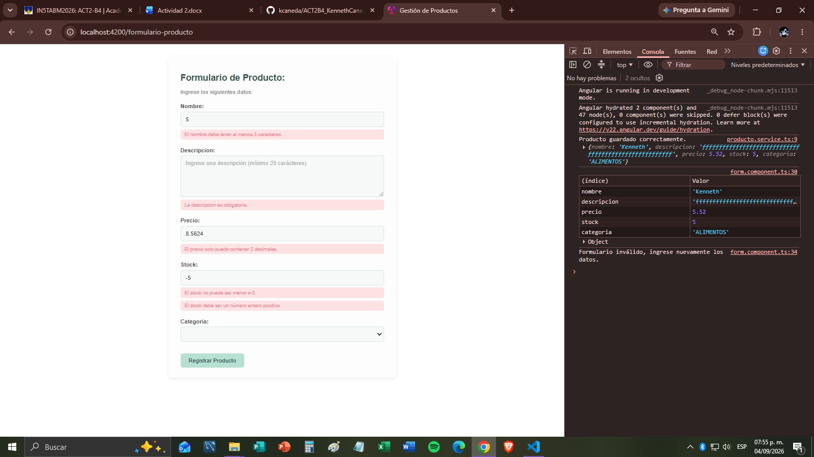

# Documentación — Formulario de Registro de Productos (Angular Reactive Forms)

## 1. Formulario creado

El formulario se construye con `FormBuilder` dentro de `FormComponent`, usando un `FormGroup` llamado `formularioProducto`. Cada campo del producto es un `FormControl` con su valor inicial y su arreglo de validadores:

| Control | Tipo de input | Propósito |
|---|---|---|
| `nombre` | `text` | Nombre del producto |
| `descripcion` | `textarea` | Descripción detallada |
| `precio` | `number` | Precio unitario |
| `stock` | `number` | Cantidad disponible |
| `categoria` | `select` | Categoría (ALIMENTOS, HOGAR, ELECTRONICOS, JUGUETES) |

El binding entre el formulario y la plantilla se hace con `[formGroup]="formularioProducto"` en el `<form>` y `formControlName="..."` en cada input, aprovechando el módulo `ReactiveFormsModule`.

## 2. Validaciones definidas

| Campo | Validadores | Regla |
|---|---|---|
| `nombre` | `required`, `minLength(3)`, `maxLength(45)` | Obligatorio, entre 3 y 45 caracteres |
| `descripcion` | `required`, `minLength(20)`, `maxLength(120)` | Obligatorio, entre 20 y 120 caracteres |
| `precio` | `required`, `min(0.01)`, `pattern(/^\d+(\.\d{1,2})?$/)` | Obligatorio, mayor a 0.01, máximo 2 decimales |
| `stock` | `required`, `min(0)`, `pattern(/^\d+$/)` | Obligatorio, entero positivo (sin decimales) |
| `categoria` | `required` | Debe seleccionarse una opción |

Cada control expone su estado (`invalid`, `touched`, `errors`) que la plantilla consulta para decidir si muestra mensajes de error. Al enviar un formulario inválido, `markAllAsTouched()` obliga a que se muestren todos los errores pendientes, incluso en campos que el usuario no tocó.

## 3. Uso de `*ngIf` y `*ngFor`

- **`*ngIf` para errores por campo:** cada bloque de error se muestra solo si el control es inválido *y* fue tocado:
  ```html
  <div *ngIf="formularioProducto.get('nombre')?.invalid && formularioProducto.get('nombre')?.touched">
  ```
  Dentro de ese bloque, `*ngIf` anidados verifican cada tipo de error específico (`required`, `minlength`, `maxlength`, `min`, `pattern`), mostrando un mensaje distinto por cada regla incumplida.

- **`*ngFor` para listar productos:** en `ListaComponent`, la tabla recorre el arreglo de productos con `*ngFor="let producto of productos; let i = index"`, mostrando una fila por producto e incluyendo el índice (`i + 1`) como número de fila.

- **`*ngIf` para estado vacío:** cuando `productos.length` es 0, una fila alternativa (`*ngIf="!productos.length"`) muestra el mensaje "No hay productos disponibles.", cubriendo el caso de lista vacía.

## 4. Envío y verificación de datos (servicio simulado)

El envío ocurre en `onSubmit()`:

1. Se valida el formulario completo con `formularioProducto.valid`.
2. **Si es válido:**
   - Se llama a `productoService.registrarProducto(formularioProducto.value)`, inyectando `ProductoService` en el constructor.
   - El servicio (`@Injectable({providedIn:'root'})`) simula el backend guardando el producto en un arreglo interno (`listaProductos`) mediante `push()`, sin persistencia real.
   - Se resetea el formulario (`reset()`) y se navega a `/lista-productos` con el `Router`.
3. **Si es inválido:**
   - Se registra un mensaje en consola y se ejecuta `markAllAsTouched()` para forzar la visualización de todos los errores.

La verificación de los datos guardados se hace en `ListaComponent`, que obtiene el arreglo actualizado con `productoService.listarProductos()` en `ngOnInit()` y lo renderiza en una tabla mediante `*ngFor`, permitiendo confirmar visualmente que los productos válidos fueron registrados correctamente.

## 5. Pruebas y capturas:



